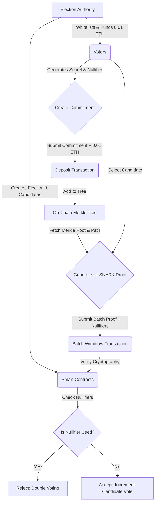

# Blockchain Voting System with Zero-Knowledge Proofs

A privacy-preserving decentralized voting system using zk-SNARKs (zero-knowledge proofs) for anonymous voting. Built with Hardhat, Circom, and Solidity.

## 🎯 Overview

This system implements a privacy-preserving voting mechanism inspired by Tornado Cash's architecture, featuring:

- **Anonymous voting** through zero-knowledge proofs
- **Batch withdrawal optimization** for efficient vote tallying (8 votes per batch)
- **MiMC hash function** for Merkle tree commitments
- **Groth16 proof system** via snarkjs
- Comprehensive gas cost analysis and performance metrics

### High-Level Algorithmic Steps

1. **Setup Phase:** Deploy the smart contracts (Tornado, Verifier, Hasher) and register the authorized candidates.
2. **Voter Verification:** Authorized voters are validated off-chain. To preserve absolute privacy, the election authority distributes exactly 0.01 ETH to a fresh, anonymous wallet generated by the voter.
3. **Vote Commitment (Deposit):** The voter generates a `secret` and a `nullifier`. They hash these together to create a `commitment` and submit it to the smart contract anonymously using their fresh wallet. The contract inserts the commitment into an on-chain Merkle Tree.
4. **Zero-Knowledge Proof Generation:** Once all deposits are collected, the voter generates a zk-SNARK proof. The proof mathematically asserts they know the `secret` and `nullifier` behind a valid commitment inside the Merkle Tree, without revealing *which* commitment is theirs.
5. **Batch Withdrawal (Tallying):** To save on transaction fees, multiple votes are grouped into a "batch" (e.g., 1, 4, 8, or 16 votes). A single zero-knowledge proof verifies the entire batch. The smart contract validates the proof, records the `nullifier` hashes to prevent double voting, and increments the respective candidates' vote counts on-chain.

### Architecture Flow



## 🚧 Project Status

**Frontend:** Under development  
**Backend & Circuits:** Fully functional  
**Testing:** Complete test suite available in `Backend/test/sample-test.js`

## ✨ Key Features

### Zero-Knowledge Privacy

- Voters create commitments without revealing identity
- Nullifier hash prevents double voting
- Merkle tree structure ensures vote integrity

### Batch Processing

- Process 8 votes simultaneously in a single withdrawal
- Significantly reduces gas costs compared to individual processing
- Custom Circom circuits for batch verification

### Performance Monitoring

- Real-time gas cost tracking
- Timing statistics (mean, p50, p90, p99)
- GBP cost estimation based on current ETH prices

## 📋 Prerequisites

- Node.js v14 or higher
- npm or yarn
- Hardhat

## 🚀 Installation

### 1. Clone the Repository

```bash
git https://github.com/mosbahaloun/Scalable-Blockchain-Voting-with-Batched-Zero-Knowledge-Proofs
cd Scalable-Blockchain-Voting-with-Batched-Zero-Knowledge
```

### 2. Install Dependencies

```bash
# Root dependencies
npm install

# Backend dependencies
cd Backend
npm install
cd ..
```

### 3. Install Circomlib

```bash
cd circuit
npm install circomlib
cd ..
```

## 🧪 Testing

The complete voting system functionality is tested in `Backend/test/sample-test.js`.

### What the Test Does

**Test 1: Full Voting Flow (40 deposits + 5 batch withdrawals)**

- Deploys contracts (Hasher, Verifier, Tornado)
- Adds 10 candidates
- Performs 40 deposits (vote commitments)
- Executes 5 batch withdrawals (8 votes each)
- Measures gas usage, timing statistics, and costs

**Test 2: Voter Registration (40 addVoter calls)**

- Measures gas costs for adding voters
- Tracks per-transaction and aggregate metrics

### Run the Tests

```bash
cd Backend
npx hardhat test test/sample-test.js
```

### Expected Output

```
✅ Deposit 1 Gas Used: [gas amount]
...
✅ Withdraw 1 Gas Used: [gas amount]
...
📊 Total Gas Used (40 deposits + 5 withdrawals of 8): [total]
💷 Estimated GBP Cost: £[amount]
⏱ Deposit witness (deposit circuit): n=40 mean=...ms
⏱ Withdraw proof gen (batch of 8): n=5 mean=...ms
```

## 📁 Project Structure

```
├── Backend/
│   ├── contracts/          # Solidity smart contracts
│   │   ├── Tornado.sol    # Main voting contract
│   │   ├── Verifier.sol   # Groth16 verifier
│   │   └── Hasher.sol     # MiMC hasher
│   ├── test/
│   │   └── sample-test.js # Complete test suite ⭐
│   ├── utils/             # Compiled circuits (.wasm, .zkey)
│   └── scripts/           # Deployment scripts
├── circuit/               # Circom circuit definitions
│   ├── BatchWithdraw_8.circom
│   ├── deposit.circom
│   └── utils/            # Circuit utilities
├── frontend/             # Next.js interface (in development)
└── test/                 # Additional test files
```

## 🔧 Technical Details

### Circuit Parameters

- **Merkle Tree Depth:** 10 levels (supports 1,024 deposits)
- **Batch Size:** 8 votes per withdrawal
- **Public Signals:** 24 per batch (8 roots + 8 nullifiers + 8 recipients)

### 📊 Benchmarks

*Note: The gas efficiency for `sample-test.js` is pending local execution due to a Node-GYP C++ build requirement on Windows for the legacy `secp256k1` dependency.*

#### Circuit Artifact Sizes vs. Batch Size

The following artifact sizes were benchmarked across different batch withdrawal sizes (1x, 4x, 8x, 16x) based on the latest circuit runs:

| Batch Size | R1CS Size | WASM Size | ZKey Size (Proving Key) |
|------------|-----------|-----------|-------------------------|
| **1x**     | ~600 KB   | ~400 KB   | ~4,500 KB (4.5 MB)      |
| **4x**     | ~2,500 KB | ~450 KB   | ~40,000 KB (40 MB)      |
| **8x**     | ~5,000 KB | ~500 KB   | ~40,000 KB (40 MB)*     |
| **16x**    | ~10,000 KB| ~600 KB   | 302,000 KB (302 MB)     |

*\*Note: 16x ZKey size grows exponentially nearing the top of the computation bounds.*

#### Gas Costs (Pending Runtime)

| Batch Size | Deposit Gas | Withdraw Gas | Amortized Gas per Vote |
|------------|-------------|--------------|------------------------|
| **1 Vote** | ~250k gas   | Pending...   | Pending...             |
| **4 Votes**| ~250k gas   | Pending...   | Pending...             |
| **8 Votes**| ~250k gas   | ~800k-1M gas | ~100k-125k gas         |
| **16 Votes**| ~250k gas  | Pending...   | Pending...             |

**Gas Costs (Additional Actions):**

- **Add Candidate:** ~50-70k gas
- **Add Voter:** ~50-80k gas

## 🛠️ Technologies

- **Solidity** - Smart contract development
- **Hardhat** - Ethereum development environment
- **Circom** - Zero-knowledge circuit compiler
- **snarkjs** - zk-SNARK proof generation
- **MiMC** - Hash function for commitments
- **Next.js** - Frontend (in progress)

## 🔐 Security Considerations

⚠️ **Educational Project:** This demonstrates zk-SNARK voting mechanisms. Production deployment requires:

- Professional security audit
- Formal circuit verification
- Enhanced key management
- Rate limiting and DoS protection

## 🗺️ Roadmap

- [x] Core smart contracts
- [x] Zero-knowledge circuits
- [x] Comprehensive test suite with metrics
- [x] Gas optimization (batch processing)
- [x] Candidate management
- [ ] Complete frontend interface
- [ ] Production security hardening

## 📝 License

MIT

## 🤝 Contributing

Contributions welcome! Please open an issue or submit a PR.

**Note:** This project demonstrates privacy-preserving voting using zero-knowledge proofs. All functionality can be tested via the test suite while the frontend is being developed.

---

**Note:** This project demonstrates privacy-preserving voting using zero-knowledge proofs. All functionality can be tested via the test suite while the frontend is being developed.
